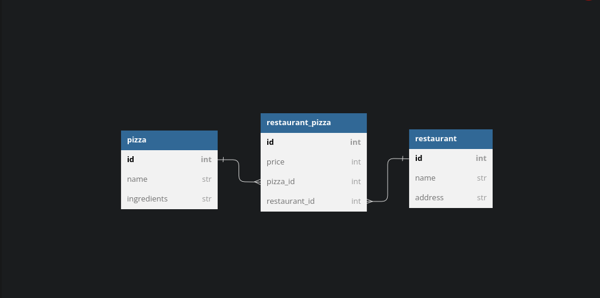

### PHASE 4 CODE CHALLENGE WEEK 1

#### Projects name

    - Pizza Restaurant

#### author information

    The following projects are created by:
    - Paul Wanyoike Ngugi
    - on 17/03/2023

#### setup/installation requirements

    - download a zip file under code tab.
    - extract the downloaded zip folder
    - open the folder with VS code
    - Run this command on the terminal to run server:
    console $ rails server
    - Use Postman to view the data through routes in BDD

##### ERD

##### BDD

As a user should;

    - GET /restaurants return all restaurants in an array

    - GET /restaurants/:id return the restaurant matching the id together with all pizza array including all pizzas related to the restaurant.

    - DELETE /restaurants/:id should delete the restaurant matching the id together with the restaurant_pizzas instances related to it.

    - GET /pizzas return all pizzas in an array

    - POST /restaurant_pizzas create a restaurant_pizza instance and end back a response with the data related to the Pizza.

##### Known Bugs

    The application works perfectly well, no bugs.

#### technologies used

    The following projects used the technologies
    :
    - RUBY
    - RAILS
    - Active Record

#### Support and Contact information

    Email: paulnyoiken@gmail.com
    Phone: +254718741382

#### License and Copyright Information

Copyright 2023 Paul Wanyoike Ngugi Licensed under [MT License]('https://github.com/Paul-ike/pizzas-restaurants/blob/master/LICENSE')

#### Video Link

